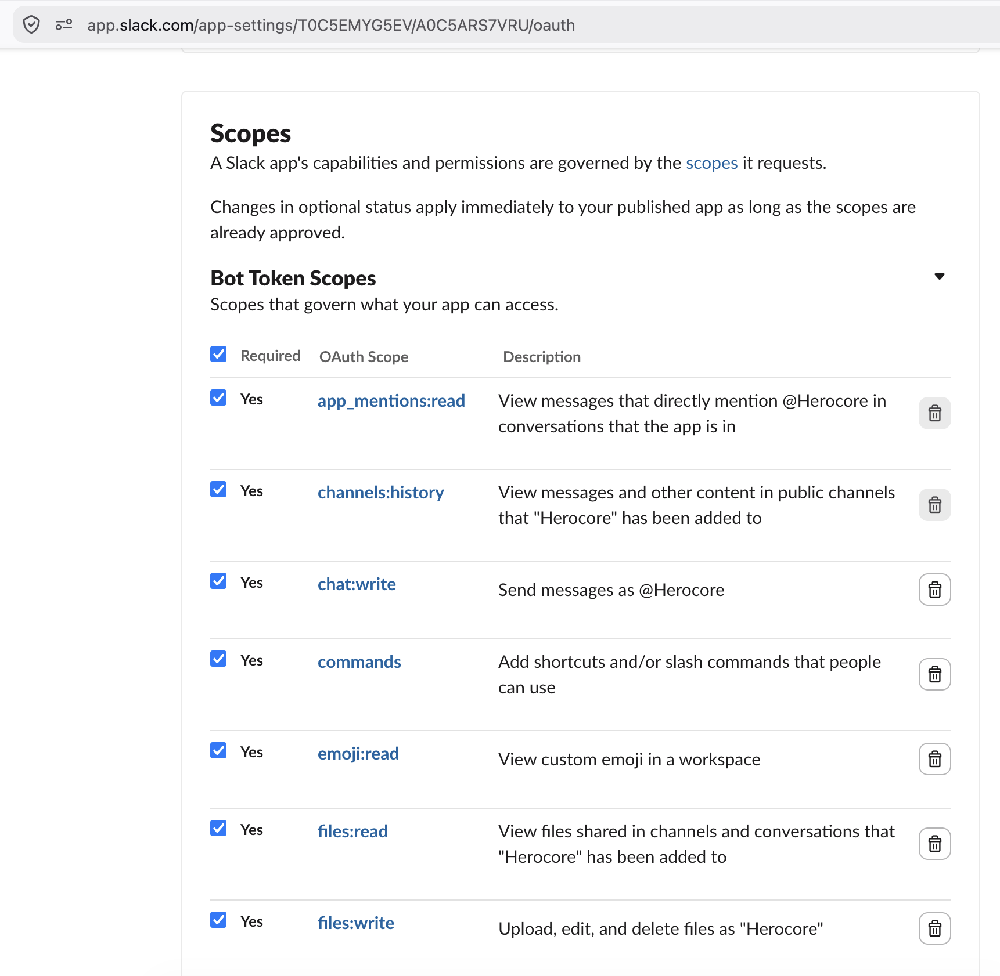
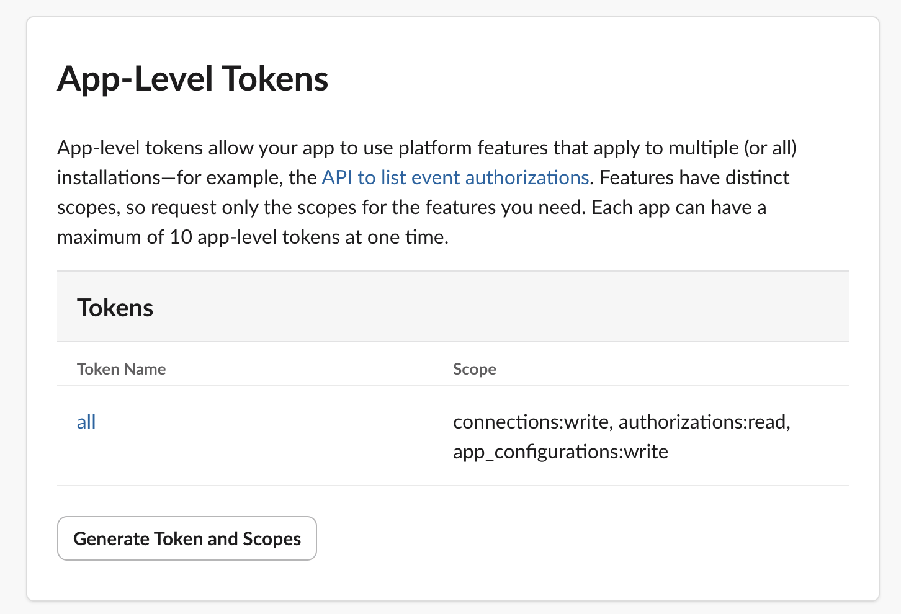
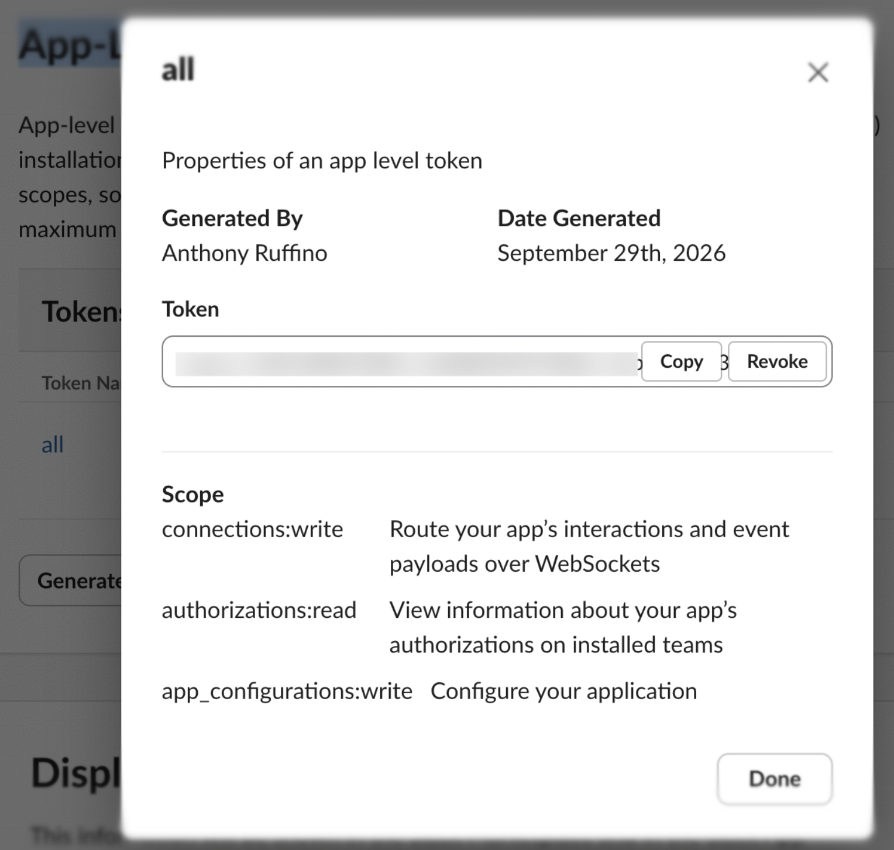

# Slack App Setup

This guide walks you through creating and configuring a Slack app for the CustomerSupport agent.

## Step 1: Create the Slack App

1. Go to [api.slack.com/apps](https://api.slack.com/apps)
2. Click **Create New App** > **From scratch**
3. Name it (e.g., "CustomerSupport") and select your workspace
4. Click **Create App**

## Step 2: Enable Socket Mode

1. In the left sidebar, go to **Socket Mode**
2. Toggle **Enable Socket Mode** to ON

## Step 3: Add Bot Token Scopes

Go to **OAuth & Permissions** in the left sidebar, scroll to **Bot Token Scopes**, and add all of the following:



| Scope | Description |
|-------|-------------|
| `app_mentions:read` | View messages that directly mention the bot |
| `channels:history` | View messages in public channels the bot is in |
| `chat:write` | Send messages as the bot |
| `commands` | Add shortcuts and/or slash commands |
| `emoji:read` | View custom emoji in the workspace |
| `files:read` | View files shared in channels the bot is in |
| `files:write` | Upload, edit, and delete files as the bot |
| `groups:history` | View messages in private channels the bot is in |
| `incoming-webhook` | Post messages to specific channels |
| `links:read` | View URLs in messages |
| `reactions:read` | View emoji reactions in channels the bot is in |
| `reactions:write` | Add and edit emoji reactions |
| `users.profile:read` | View profile details about people in the workspace |
| `users:read` | View people in the workspace |
| `users:read.email` | View email addresses of people in the workspace |

## Step 4: Install the App to Your Workspace

1. Go to **OAuth & Permissions**
2. Click **Install to Workspace** (or **Reinstall to Workspace** if updating scopes)
3. Review and allow the permissions
4. Copy the **Bot User OAuth Token** — this is your `SLACK_BOT_TOKEN` (starts with `xoxb-`)

## Step 5: Create an App-Level Token

App-level tokens enable Socket Mode, which the harness uses for real-time communication.

1. Go to **Basic Information** in the left sidebar
2. Scroll to **App-Level Tokens**
3. Click **Generate Token and Scopes**
4. Name it (e.g., "all")
5. Add these scopes:
   - `connections:write` — route interactions over WebSockets
   - `authorizations:read` — view authorization info
   - `app_configurations:write` — configure the application



6. Click **Generate**
7. Copy the token — this is your `SLACK_APP_TOKEN` (starts with `xapp-`)



## Step 6: Enable Event Subscriptions

1. Go to **Event Subscriptions** in the left sidebar
2. Toggle **Enable Events** to ON
3. Under **Subscribe to bot events**, add:
   - `app_mention` — triggers when someone @mentions the bot
   - `message.channels` — triggers on messages in public channels
   - `message.groups` — triggers on messages in private channels
4. Click **Save Changes**

## Step 7: Add Tokens to Your Environment

Paste the two tokens into your `.env` file:

```
SLACK_APP_TOKEN=xapp-1-...
SLACK_BOT_TOKEN=xoxb-...
```

Or run `make setup` and paste them when prompted.
